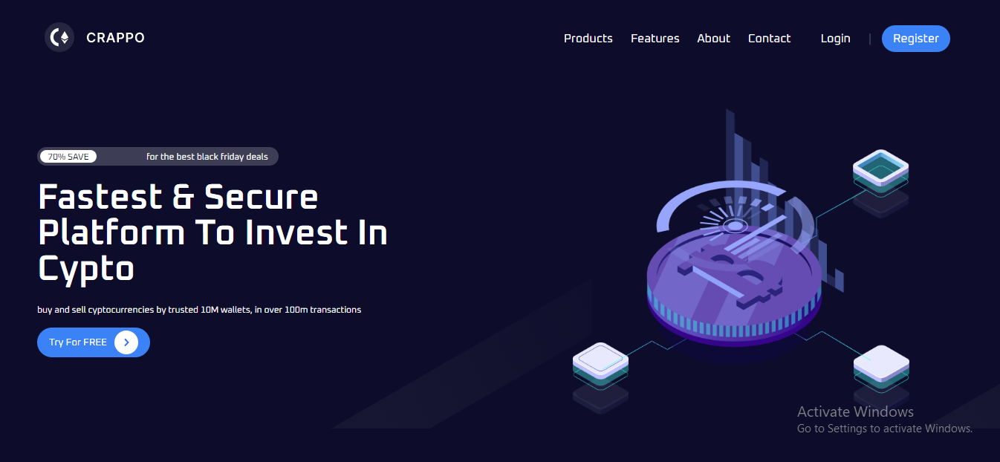

# CRAPPO CRYPTO CURRENCY

This is a solution to the [September Coding 360 Challenge](https://cypto-currency.vercel.app/). 

## Table of contents

- [Overview](#overview)
  - [The challenge](#the-challenge)
  - [Screenshot](#screenshot)
  - [Links](#links)
- [My process](#my-process)
  - [Built with](#built-with)
  - [What I learned](#what-i-learned)
- [Author](#author)

## Overview

### The challenge

We're supposed to clone a pre-existing site

### Screenshot

##### Desktop

##### Mobile

### Links

- Solution URL: [Github Repo](https://github.com/ronniiii-i/crypto_currency)
- Live Site URL: [CRAPPO Cypto](https://crappo-crypto-currency.vercel.app/)

## My process

### Built with

- Semantic HTML5 markup
- Flexbox
- [GSAP/GreenSock](https://greensock.com/) - Animation library

### What I learned

- I learnt how to use the Green Sock animation library. That was fun😅

## Author
👤 **Princess Roni Egbu**

* Twitter: [@ronniiii_i](https://twitter.com/ronniiii_i)